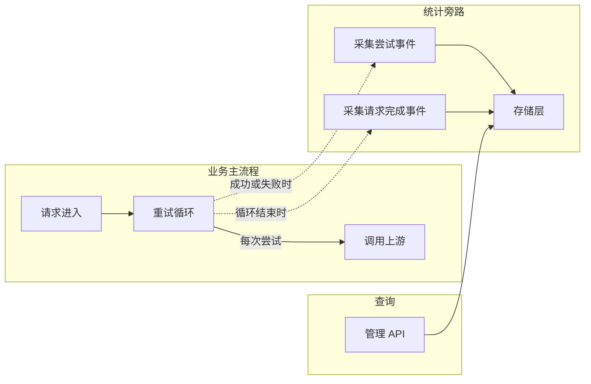

# Relay 请求统计采集系统 — 设计方案

## 1. 背景与问题

API 网关的 relay 请求在失败后会自动重试、切换渠道（详见 `controller/relay.go` 中的重试循环）。当前缺少量化数据来回答：

- 重试机制的实际效果如何？多少请求靠重试救回来了？
- 哪些模型、渠道的错误率偏高？
- 统计中有多少是"假错误"——客户端参数错误（400）、限流（429）、安全拦截等预期行为，并非渠道真实故障？

需要一套统计采集机制来回答这些问题，且**不能影响现有业务流程**。

## 2. 需求

1. **基础采集**：记录每次尝试和整体请求的成功/失败，统计重试恢复率
2. **错误排除**：通过可配置规则把"非真实错误"从统计中过滤，减少噪声
3. **维度聚合**：支持按模型/渠道/分组等维度切片查看，且维度可灵活扩展

## 3. 设计思路

### 3.1 旁路采集，不侵入业务

核心原则：统计是观测行为，不能阻塞或影响请求处理。

- 在现有重试循环中以**旁路方式**插入采集调用
- 采集调用外层包 panic recovery，任何采集异常都静默忽略
- 不启用采集时走 noop 实现，零开销



### 3.2 双层事件模型

设计两种粒度的事件：

**尝试事件（Attempt）**— 重试循环中每一次对上游的调用产生一条：
- 渠道信息（ID/类型/名称）、模型名、分组
- 成功/失败、状态码、错误码、错误消息
- 本次耗时
- 是否被排除（由分类器判定）

**请求完成事件（Request）**— 整个请求结束时产生一条：
- 用户/Token 标识、原始模型、分组
- 总尝试次数、最终成功与否
- 是否发生过重试、是否由重试恢复（核心指标）
- 尝试过的渠道链路
- 总耗时

两层事件配合，既能看单次渠道调用的微观表现，也能看整体请求的宏观结果。

### 3.3 全局聚合计数

统计面向两类角色，关注点不同：

**用户视角**（关注最终结果）：
- 请求最终成功率 — 经过重试后，用户请求最终拿到结果的比率
- 渠道统计 — 各渠道的最终表现

**管理员视角**（关注系统健康度）：
- 单次尝试成功率 — 每次对上游调用的原始成功率，反映渠道真实质量
- 重试恢复率 — 首次失败但靠重试救回来的比率，衡量重试机制的价值

具体指标：

| 指标 | 说明 | 面向 |
|------|------|------|
| 总请求数 / 成功 / 失败 | 整体请求维度的最终结果 | 用户 + 管理 |
| 总尝试数 / 成功 / 失败 / 被排除 | 单次尝试维度的原始结果 | 管理 |
| 重试请求数 | 发生过重试的请求数 | 管理 |
| 重试恢复数 / 恢复率 | 曾失败但最终成功的请求数及占比 | 管理 |

这些计数使用原子操作实时更新，无锁，查询时直接读取快照。

### 3.4 错误排除机制

#### 动机

400/429/安全拦截等不代表渠道故障，如果全部计入"失败"会让统计失真。需要一个**可配置的分类器**来标记这类错误为"已排除"。

#### 方案

定义排除规则，每条规则包含：
- **渠道类型过滤**（可选）：限定规则只对特定渠道类型生效
- **错误匹配条件**：错误码、HTTP 状态码、错误消息关键词（三者 OR 匹配）

匹配逻辑：
- 渠道类型是 AND 前置条件（指定了就必须匹配）
- 错误条件之间 OR（任一命中即可）
- 多条规则之间 OR（任一规则命中即排除）
- 关键词匹配复用现有的 Aho-Corasick 多模式匹配（`AcSearch`），大小写不敏感

**关键约束**：排除只影响统计计数，**不影响**重试决策、渠道禁用、错误日志等任何业务逻辑。

#### 配置

规则以 JSON 数组形式存储在 DB Option 表中，支持通过管理 API 运行时更新，无需重启。

规则示例：

```json
[
  {
    "status_codes": [400, 422],
    "error_codes": ["invalid_request_error"],
    "description": "客户端参数错误"
  },
  {
    "channel_types": [24],
    "message_keywords": ["safety", "blocked"],
    "description": "Gemini 安全拦截"
  }
]
```

### 3.5 维度聚合

采用 **查询时聚合（compute-on-read）** 方案：

- 写入路径只做两件事：推事件到环形缓冲区 + 更新全局原子计数器，不做任何维度拆分
- 查询路径从缓冲区取快照，按请求的维度实时遍历聚合
- 新增维度只需注册一个"从事件中提取 key"的函数，缓冲区内已有事件立即可按新维度回溯

内置维度：

| 维度 | 适用事件 | 说明 |
|------|---------|------|
| model | 尝试 / 请求 | 按模型分组 |
| channel | 尝试 | 按渠道 ID 分组 |
| channel_type | 尝试 | 按渠道类型分组 |
| group | 尝试 / 请求 | 按用户分组 |

多维度可组合查询（如按"模型+渠道"），产生复合键。

### 3.6 接口化设计

采集器和分类器都设计为接口：

- **采集器接口**：定义采集事件、查询计数、查询明细、维度聚合等方法。当前提供内存实现，后续可替换为 Redis / DB / Prometheus 等持久化实现
- **分类器接口**：定义错误分类方法。当前提供基于规则的实现，后续可扩展为基于 ML 或外部服务的分类

两个接口通过全局注册表管理，启动时初始化，运行时可热替换。

## 4. 埋点位置

在 `controller/relay.go` 的 `Relay()` 和 `RelayTask()` 两个函数的重试循环中插入采集调用：

```
重试循环 {
    选择渠道
    记录开始时间
    调用上游

    if 成功:
        采集尝试事件（成功）
        采集请求完成事件（成功）
        return

    采集尝试事件（失败，分类器在内部判定是否排除）
    处理渠道错误（原有逻辑）
    判断是否重试（原有逻辑）
}

采集请求完成事件（最终失败）
```

## 5. 约束

- 内存存储，进程重启后数据丢失
- 环形缓冲区容量固定，满了覆盖旧数据
- 维度聚合只能回溯缓冲区内的事件，全局计数器不支持维度拆分
- 多实例部署时各实例独立统计，不聚合
