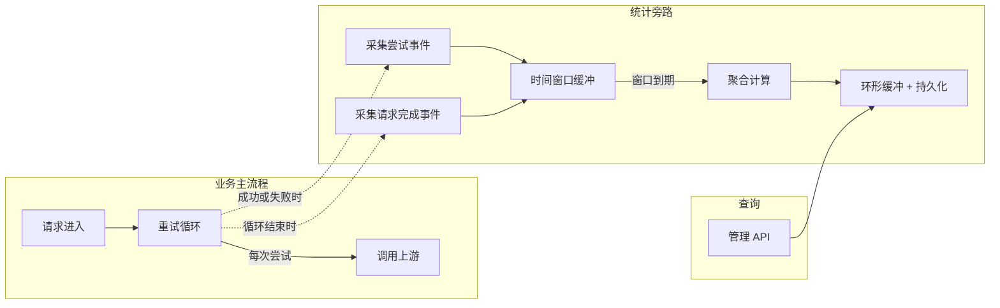

# Relay 请求统计采集系统 — 设计方案

## 1. 背景与问题

API 网关的 relay 请求在失败后会自动重试、切换渠道（`controller/relay.go` 重试循环）。当前缺少量化数据来回答：

- 重试机制的实际效果如何？多少请求靠重试救回来了？
- 哪些模型、渠道的错误率偏高？
- 统计中有多少是"假错误"（客户端参数错误、限流等预期行为）？
- 异步任务（Midjourney、Suno、Kling 等）的提交成功率和执行成功率分别是多少？

需要一套统计采集机制来回答这些问题，且**不能影响现有业务流程**。

## 2. 需求

1. **基础采集**：记录同步请求和异步任务的成功/失败，统计重试恢复率
2. **错误排除**：通过可配置规则（支持按模型匹配）把"非真实错误"从统计中过滤
3. **维度聚合**：支持按模型/渠道/分组等维度切片查看
4. **时间窗口聚合**：不直接推送原始事件，先在固定时间窗口内收集，窗口到期后计算聚合指标（平均成功率、TPS、响应速度等）再推送
5. **错误评级与渠道打分**：对错误进行 level 分级，结合统计数据为渠道计算百分制健康评分
6. **数据持久化**：用户可见数据重启可恢复；管理数据定时缓存，防止进程崩溃丢失全部数据

## 3. 设计思路

### 3.1 旁路采集，不侵入业务

核心原则：统计是观测行为，不能阻塞或影响请求处理。

- 在现有重试循环中以**旁路方式**插入采集调用
- 采集调用外层包 panic recovery，任何采集异常都静默忽略
- 不启用采集时走 noop 实现，零开销



### 3.2 双层事件模型

设计两种粒度的事件：

**尝试事件（Attempt）**— 重试循环中每一次对上游的调用产生一条：
- 渠道信息（ID/名称）、模型名、分组
- 成功/失败、状态码、错误码、错误消息
- 本次耗时（含首字响应时间）
- 是否被排除（由分类器判定）
- 错误 level 评级

**请求完成事件（Request）**— 整个请求结束时产生一条：
- 用户/Token 标识、原始模型、分组
- 总尝试次数、最终成功与否
- 是否发生过重试、是否由重试恢复（核心指标）
- 尝试过的渠道链路
- 总耗时

两层事件配合，既能看单次渠道调用的微观表现，也能看整体请求的宏观结果。

### 3.3 统计指标

统计面向两类角色，关注点不同：

**用户视角**（关注最终结果，数据需持久化，重启可恢复）：
- 请求最终成功率 — 经过重试后，用户请求最终拿到结果的比率
- 渠道统计 — 各渠道的最终表现

**管理员视角**（关注系统健康度，定时缓存，容忍少量丢失）：
- 单次尝试成功率 — 每次对上游调用的原始成功率，反映渠道真实质量
- 重试恢复率 — 首次失败但靠重试救回来的比率，衡量重试机制的价值
- 被排除的尝试数 — 有多少"假错误"被过滤掉了

**同步模型指标**：

| 指标 | 说明 |
|------|------|
| TPS | 每秒处理请求数（时间窗口内的平均值） |
| 首字响应时间 | 流式请求从发出到收到第一个 token 的耗时 |
| 成功率 | 请求最终成功率（用户视角）/ 单次尝试成功率（管理视角） |

**异步任务指标**：

| 指标 | 说明 |
|------|------|
| 响应时间 | 从提交到上游返回 taskID 的耗时 |
| 提交成功率 | `RelayTask` / `RelayMidjourney` 提交阶段的成功率 |
| 执行时间 | 从提交到任务到达终态（SUCCESS/FAILURE）的总耗时 |
| 执行成功率 | 任务最终 SUCCESS 的比率（区别于提交成功率） |

### 3.4 错误排除机制

#### 动机

400/429/安全拦截等不代表渠道故障，如果全部计入"失败"会让统计失真。需要一个**可配置的分类器**来标记这类错误为"已排除"。

#### 方案

定义排除规则，每条规则包含：
- **模型匹配**（可选）：限定规则只对特定模型生效，支持 `default` 兜底
- **渠道类型过滤**（可选）：限定规则只对特定渠道类型生效
- **错误匹配条件**：错误码、HTTP 状态码、错误消息关键词（三者 OR 匹配）

模型匹配优先级：精确匹配模型名 > `default` 兜底。同一模型下多条规则互不冲突，避免统一配置和模型配置冲突。

匹配逻辑：
- 模型和渠道类型是 AND 前置条件（指定了就必须匹配）
- 错误条件之间 OR（任一命中即可）
- 多条规则之间 OR（任一规则命中即排除）
- 关键词匹配复用 Aho-Corasick 多模式匹配（`AcSearch`），大小写不敏感

**异步任务的错误排除**：比对 Task 模型的 `fail_reason` 字段（如参数错误），同样适用排除规则，过滤非渠道故障。

**关键约束**：排除只影响统计计数，**不影响**重试决策、渠道禁用、错误日志等任何业务逻辑。

#### 配置结构

```json
{
  "model": "gpt-4",
  "channel_types": [1, 6],
  "error_codes": ["invalid_request_error"],
  "status_codes": [400, 429],
  "message_keywords": ["context_length_exceeded"],
  "description": "GPT-4 客户端参数错误"
}
```

`model` 字段为空或 `"default"` 时作为兜底规则，适用于所有模型。

#### 内置默认规则

系统开箱自带以下排除规则（可通过管理 API 或 DB Option 覆盖）：

| 规则 | 排除条件 | 说明 |
|------|---------|------|
| 客户端参数错误 | 400/422, `invalid_request` 等 | 非渠道故障 |
| 限流 | 429 | 暂时性，非渠道故障 |
| 内容安全 | `sensitive_words_detected`, `prompt_blocked`, safety/blocked 关键词 | 预期行为 |
| 用户配额不足 | `insufficient_user_quota` 等 | 非渠道问题 |
| Gemini 安全拦截 | channel_type=24 + safety/blocked/recitation | Gemini 特有 |

### 3.5 时间窗口聚合

#### 动机

高并发场景（单模型可能 1w RPM），直接推送原始事件到环形缓冲区会导致：
- 缓冲区快速被覆盖，有效数据窗口太短
- 查询时遍历大量原始事件计算成本高
- 无法提供 TPS、平均响应时间等时间窗口指标

#### 方案

在原始事件和环形缓冲区之间增加**时间窗口缓冲层**：

1. 原始事件先进入固定时间窗口（如 5 分钟）的内存缓冲
2. 窗口到期或缓冲满时，触发聚合计算：
   - 平均成功率
   - TPS（请求数 / 窗口时长）
   - 平均响应时间 / 首字响应时间
   - 错误分布
3. 聚合后的**窗口摘要**推入环形缓冲区

这样环形缓冲区存的是每个时间窗口的摘要而非原始事件，存储效率大幅提升，一万条可覆盖约 34 天（5 分钟窗口）。

### 3.6 维度聚合

采用 **查询时聚合（compute-on-read）** 方案：

- 写入路径只推聚合后的窗口摘要到环形缓冲区，不做维度拆分
- 查询路径从缓冲区取快照，按请求的维度实时聚合
- 新增维度只需注册一个"从事件中提取 key"的函数

内置维度：

| 维度 | 适用事件 | 说明 |
|------|---------|------|
| model | 尝试 / 请求 / 任务 | 按模型分组 |
| channel | 尝试 | 按渠道 ID 分组 |
| group | 尝试 / 请求 | 按用户分组 |

多维度可组合查询（如按"模型+渠道"），产生复合键。

### 3.7 错误评级与渠道评分

#### 错误 Level

对每个匹配到的错误分配一个严重级别（level）：

| Level | 含义 | 示例 |
|-------|------|------|
| 0 | 已排除，不计入 | 客户端参数错误、限流 |
| 1（默认） | 普通错误 | 超时、临时故障 |
| 2 | 较严重 | 认证失败、配额耗尽 |
| 3 | 严重 | 渠道完全不可用、持续 5xx |

level 在排除规则中配置，未匹配任何规则的错误默认 level=1。

#### 渠道健康评分（百分制）

综合以下因素计算渠道健康评分（0-100）：

```
评分 = 基础分(成功率) - 错误严重度扣分 + 恢复加分 + 速度加分

其中：
- 基础分 = 成功率 × 75（满分 75）
- 错误严重度扣分 = Σ(level_i × 权重_i × 错误占比_i)，上限 25 分
  - level 权重：L1=1, L2=3, L3=6
- 恢复加分 = 重试恢复率 × 5（满分 5）
- 速度加分 = 根据平均响应时间分档，满分 20 分
  - ≤500ms: 20, ≤2s: 16, ≤5s: 10, ≤10s: 4, >10s: 0
  - 无数据时取半分（10）避免虚高
```

健康渠道（100% 成功 + 快速响应）评分约 95 分。

评分在每个时间窗口聚合时计算，可按模型+渠道维度查看。

### 3.8 接口化设计

采集器和分类器都设计为接口：

- **采集器接口**：定义采集事件、查询计数、查询明细、维度聚合等方法。当前提供内存实现，后续可替换为 Redis / DB / Prometheus 等持久化实现
- **分类器接口**：定义错误分类方法（含 level 评级）。当前提供基于规则的实现

两个接口通过全局注册表管理，启动时初始化，运行时可热替换。

### 3.9 数据持久化策略

| 数据类别 | 持久化方式 | 恢复策略 | 容忍丢失 |
|---------|-----------|---------|---------|
| 用户可见数据（最终成功率、渠道统计） | 写入 DB / Redis，每次窗口聚合时持久化 | 启动时从 DB/Redis 恢复 | 不容忍 |
| 管理数据（尝试成功率、重试恢复率、评分） | 定时缓存到 DB/Redis（如每 N 个窗口） | 启动时恢复缓存快照 | 容忍少量丢失 |
| 排除规则配置 | DB Option 表 | 启动时加载 | 不容忍 |

## 4. 埋点位置

### 同步请求

在 `controller/relay.go` 的 `Relay()` 重试循环中：

```
重试循环 {
    选择渠道
    记录开始时间
    调用上游

    if 成功:
        采集尝试事件（成功，含首字响应时间）
        采集请求完成事件（成功）
        return

    采集尝试事件（失败，分类器判定排除 + level）
    处理渠道错误（原有逻辑）
    判断是否重试（原有逻辑）
}

采集请求完成事件（最终失败）
```

### 异步任务 — 提交阶段

在 `controller/relay.go` 的 `RelayTask()` 和 `RelayMidjourney()` 中：

- `RelayTask()`：已有重试循环，在循环内采集提交尝试事件
- `RelayMidjourney()`：无重试，单次调用，采集提交结果

### 异步任务 — 执行阶段

在 `service/task_polling.go` 的轮询逻辑中，任务到达终态（SUCCESS/FAILURE）时：

- 采集任务执行完成事件（含执行时间、执行成功与否、`fail_reason`）
- 对 `fail_reason` 应用错误排除规则，过滤参数错误等非渠道故障

### Panic 捕获

在 `main.go` 的 `gin.CustomRecovery` 中，panic 时采集一条失败事件，确保异常崩溃也被统计到。

## 5. 约束

- 时间窗口内的原始事件在聚合后丢弃，无法回溯单条明细
- 环形缓冲区容量固定，存储窗口摘要，满了覆盖旧数据
- 多实例部署时，如使用内存实现则各实例独立统计；使用 Redis/DB 持久化则可聚合
- 渠道评分公式中的权重需要根据实际运行数据调优
